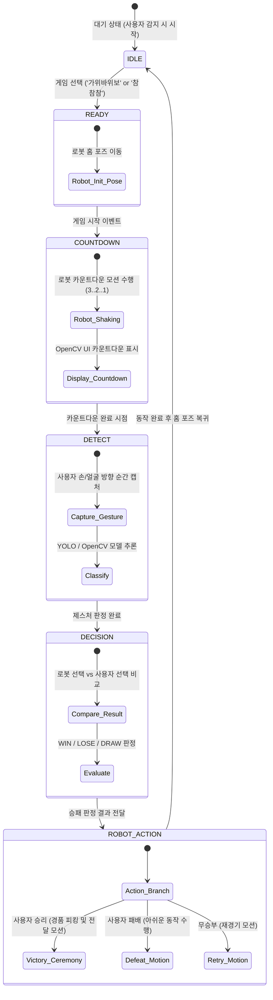

제출 및 GitHub 저장소에 활용하실 수 있는 **기술 명세서(`README.md` / `TECHNICAL_SPECIFICATION.md`)** 표준 마크다운 문서 형태입니다. 복사해서 바로 `.md` 파일로 저장하여 사용하시면 됩니다.

---

# 🤖 체험형 미니게임 및 경품 전달 이벤트 로봇 프로젝트

> **OpenCV/YOLO 비전 인식과 OpenMANIPULATOR-X 기반의 HRI(Human-Robot Interaction) 팝업스토어/전시회 집객용 이벤트 로봇 시스템**

---

## 1. 프로젝트 개요 (Overview)

### 1.1 배경 및 목적

* **체험형 이벤트 로봇 구현:** 전시회, 팝업스토어 등에서 방문객의 흥미를 유발하고 집객 효과를 극대화하기 위해 실시간 미니게임(가위바위보, 참참참)을 수행하는 로봇 시스템 구축
* **HRI & 자동화 경품 지급:** 사용자가 게임에서 승리할 경우, 로봇 팔이 경품 및 쿠폰을 직접 피킹(Picking)하여 전달하는 비대면 체험형 서비스 제공

### 1.2 주요 목표

* **실시간 비전 인식:** OpenCV 및 YOLO 모델을 활용하여 사용자의 손 모양(가위/바위/보) 및 얼굴/고개 방향(좌/우/중앙)을 실시간으로 추적 및 분류
* **FSM 기반 게임 제어:** Decision Node를 구축하여 카운트다운, 게임 상태 관리, 승패 판정 및 스코어 보드 실시간 업데이트 처리
* **정밀 관절 제어:** `JointTrajectory` 및 `MoveIt 2` 포즈 매핑을 통한 자연스러운 카운트다운, 모션 표현(승리 세레머니, 패배 포즈) 및 그리퍼 제어
* **검증 환경:** Gazebo Harmonics 시뮬레이션 및 실제 OpenMANIPULATOR-X 하드웨어 검증

---

## 2. 팀 구성 및 역할 분담 (Team & Roles)

| 구분 | 담당자 | 주요 수행 업무 |
| --- | --- | --- |
| **Vision** | **김동호**, 이상진 | • 카메라 영상 스트림 수신 및 전처리<br>

<br>• YOLO / OpenCV 기반 손 제스처 분류 모델 구현<br>

<br>• Face/Gaze 추적 알고리즘을 활용한 고개 방향 검출 |
| **ROS Integration** | **김동호**, 김병준 | • Vision - Decision - Robot 노드 간 Topic/Action 인터페이스 설계<br>

<br>• FSM(유한 상태 머신) 기반 게임 로직 구축 및 Launch 파일 작성 |
| **Robot Control** | 김병준, 이상진 | • OpenMANIPULATOR-X 관절 제어 및 Kinematics 연동<br>

<br>• 게임 상태별 포즈(Pose/Trajectory) 정의 및 그리퍼(Gripper) 액션 구현 |
| **QA & Doc** | **김동호** | • 게임 시나리오 테스트, 에러 상태 예외 처리 검증<br>

<br>• 시연 영상 편집, GitHub README 및 기술 명세서 작성 |

---

## 3. 시스템 아키텍처 (System Architecture)

### 3.1 노드 및 데이터 흐름 (Node Graph)

```text
+------------------------------------+
|  USB Camera / Gazebo Camera Node   |
+------------------------------------+
                  │
                  │ /camera/image_raw (sensor_msgs/msg/Image)
                  ▼
+------------------------------------+
|            Vision Node             |
|   (OpenCV / YOLO Gesture & Face)   |
+------------------------------------+
                  │
                  │ /game/user_gesture (std_msgs/msg/String)
                  │ /game/detection_result (custom_interfaces/msg/DetectionResult)
                  ▼
+------------------------------------+
|           Decision Node            |
|       (Game State Machine)         |
+------------------------------------+
                  │
                  │ FollowJointTrajectory (control_msgs/action/FollowJointTrajectory)
                  │ /robot/command_pose (std_msgs/msg/String)
                  ▼
+------------------------------------+
|         Robot Control Node         |
|        (OpenMANIPULATOR-X)         |
+------------------------------------+
                  │
                  ▼
+-------------------------------------------------------------+
|              Monitoring & Visualization System              |
|  • OpenCV Result Window  • RViz2 Monitoring  • Console Log  |
+-------------------------------------------------------------+

```

### 3.2 주요 ROS 2 인터페이스 명세

| Interface Name | Type | Type Detail | Description |
| --- | --- | --- | --- |
| `/camera/image_raw` | Topic (Sub) | `sensor_msgs/msg/Image` | 카메라 원본 영상 데이터 스트림 |
| `/game/user_gesture` | Topic (Pub) | `std_msgs/msg/String` | 검출된 사용자 제스처 (`ROCK`, `PAPER`, `SCISSORS`, `LEFT`, `RIGHT`) |
| `/game/state` | Topic (Pub) | `std_msgs/msg/String` | 현재 게임 진행 상태 (`IDLE`, `COUNTDOWN`, `DETECT`, `RESULT`) |
| `/arm_controller/follow_joint_trajectory` | Action | `control_msgs/action/FollowJointTrajectory` | 로봇 관절 궤적 제어 명령 |

---

## 4. 미니게임 시나리오 및 상태 머신 (State Machine)



### 4.1 구현 게임 세부 규칙

1. **가위바위보 (Rock-Paper-Scissors)**
* 로봇이 카운트다운 모션을 수행하며 무작위 또는 알고리즘 기반 손 모양(Pose)을 결정합니다.
* 지정된 카운트 타임스탬프 시점에 카메라 영상을 캡처하여 YOLO 모델이 사용자의 제스처를 인식합니다.
* 승패 판정 후 승리 시 로봇 팔이 경품 영역으로 이동하여 그리퍼로 쿠폰/경품을 피킹하여 전달합니다.


2. **참참참 (Cham-Cham-Cham)**
* 로봇이 좌/우 중 하나의 방향으로 지시봉/손끝 포즈를 제시합니다.
* OpenCV/YOLO 비전 파이프라인이 사용자의 고개 방향 또는 손가락 지시 방향을 추적합니다.
* 방향 일치 여부에 따라 승/패를 판정하고 대응하는 로봇 모션을 수행합니다.


---

## 5. 모니터링 및 모듈 검증 (Monitoring & Verification)

* **OpenCV Result Window:** 실시간 카메라 입력 프레임 위에 YOLO Bounding Box, 랜드마크, 카운트다운 텍스트, 현재 점수 및 승패 결과를 Overlaid 가공하여 시각화
* **Console Log & RQt:** ROS 2 Node의 라이프사이클 관리, Action 진행률 및 예외 메시지 출력
* **RViz2:** `robot_state_publisher` 및 TF2 좌표계를 연동하여 시뮬레이션 및 실물 로봇의 현재 관절 각도 모니터링
